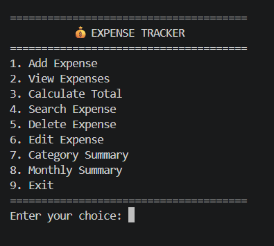
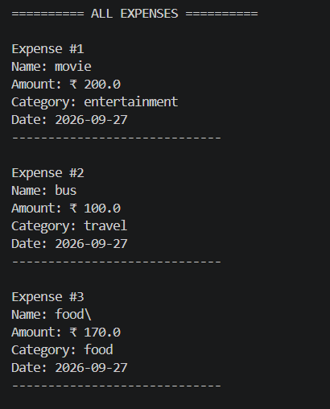

# 💰 Expense Tracker

A simple command-line Expense Tracker built with Python.

This project allows users to add, view, edit, delete, search, and analyze their expenses.
Expense data is stored locally using a JSON file so that the data remains available after the program is closed.

##  Features

-  Add expenses
-  View all expenses
-  Calculate total expenses
-  Search expenses
-  Edit expenses
-  Delete expenses
-  Organize expenses by category
-  Track expense dates
-  View category summary
-  View monthly summary
-  Store data using JSON
-  Handle invalid user input

##  Technologies Used

- Python
- JSON
- File Handling
- Functions
- Lists
- Dictionaries
- Loops
- Conditional Statements
- Exception Handling
- Date and Time

##  Project Structure

expense-tracker-python/
│
├── main.py
├── README.md
├── .gitignore
└── .gitattributes

## 📸 Screenshots

### Main Menu

### Add and View Expenses

